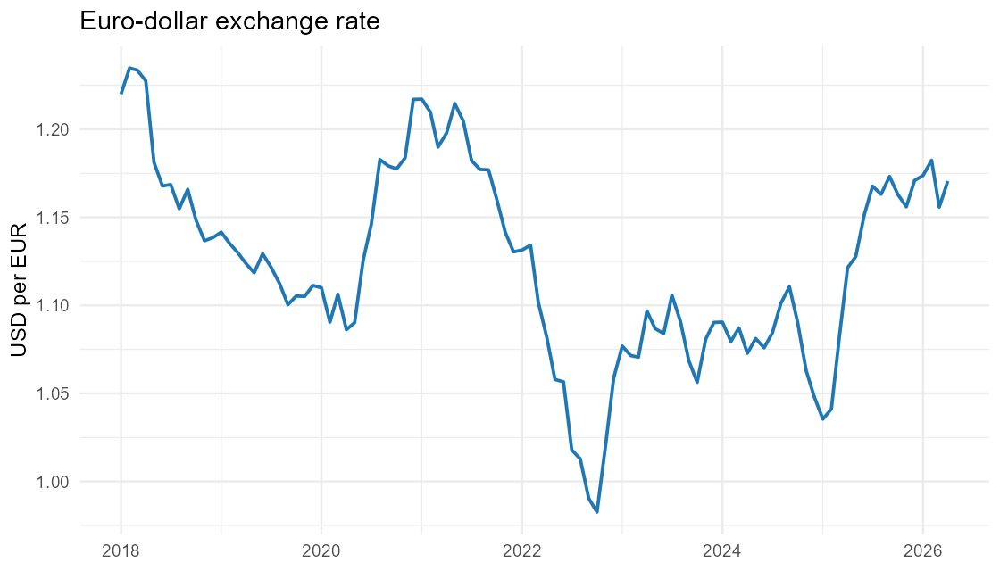

# r2webstat

`r2webstat` is an R client for the redesigned Banque de France Webstat portal.
The new portal is backed by the Huwise/Opendatasoft Explore API v2.1, so this
package does not reuse the old `rwebstat` endpoints.

The package currently exposes:

- `ws_catalog()` for the public Explore catalog.
- `ws_records()` and `ws_structure()` for any accessible Explore dataset.
- `ws_datasets()`, `ws_series()`, and `ws_observations()` for Webstat business datasets.
- `ws_facets()` for facet exploration.

Some Webstat business datasets, including `series`, `observations`, and
`webstat-datasets`, require a Webstat API key. The official Webstat portal
uses an `Authorization: Apikey ...` header for browser API calls; `r2webstat`
bundles that public frontend key as a fallback so most users do not need to
configure anything. If you want to use your own key, save it once on your
machine:

```r
library(r2webstat)

ws_save_api_key("your-api-key")
ws_has_api_key()
```

Restart R after saving the key. For temporary use in the current session only,
use `ws_set_api_key("your-api-key")`.

## Examples

```r
library(r2webstat)
library(ggplot2)

# Optional: use your own key instead of the package fallback
# ws_save_api_key("your-api-key")

# Explore catalog visible to your key/session
ws_catalog(limit = 5)

# Search series metadata
series <- ws_series(dataset_id = "EXR", limit = 20)

# Get the latest available observations for one or more series
obs <- ws_observations(
  series_key = "EXR.M.USD.EUR.SP00.A",
  order_by = "time_period_end desc",
  limit = 100,
  data_only = TRUE
)

df <- obs[order(as.Date(obs$period)), ]
df$obs_value <- as.numeric(df$obs_value)

ggplot(df, aes(as.Date(period), obs_value)) +
  geom_line(linewidth = 0.8, colour = "#1f77b4") +
  labs(
    title = "Euro-dollar exchange rate",
    x = NULL,
    y = "USD per EUR"
  ) +
  theme_minimal()
```



## Notes on the new Webstat API

The redesigned Webstat site uses the Explore v2.1 REST API under
`https://webstat.banque-france.fr/api/explore/v2.1`. Query parameters use
ODSQL (`where`, `select`, `group_by`, `order_by`, `refine`, `exclude`).
The `records` endpoint is paginated and capped. Normal package requests send
the API key in the HTTP `Authorization` header, matching the official Webstat
frontend.

Official migration guide:
<https://webstat.banque-france.fr/fr/pages/guide-migration-api/>
